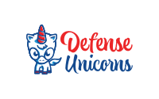

# Defense Unicorns Labs

At Defense Unicorns, we accelerate software deployment with UDS—our secure,
highly portable platform, built to solve the unique challenges of delivering to
disconnected and infrequently connected environments for defense and enterprise
applications. We also spend a great deal of time building systems to address
Mission Needs, or just solving our own problems, which we would like to share
with the world.

Defense Unicorns Labs is our place to share novel or interesting tools or code
samples to back an Engineering Blog Post that are not part of our standard
supported, Open Source offerings as you will find in our main GitHub
Organization.

While these repositories comes with no guarantee or warrantee they may just help
you along.